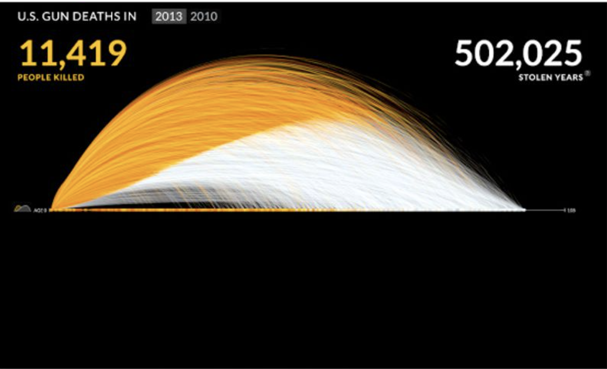
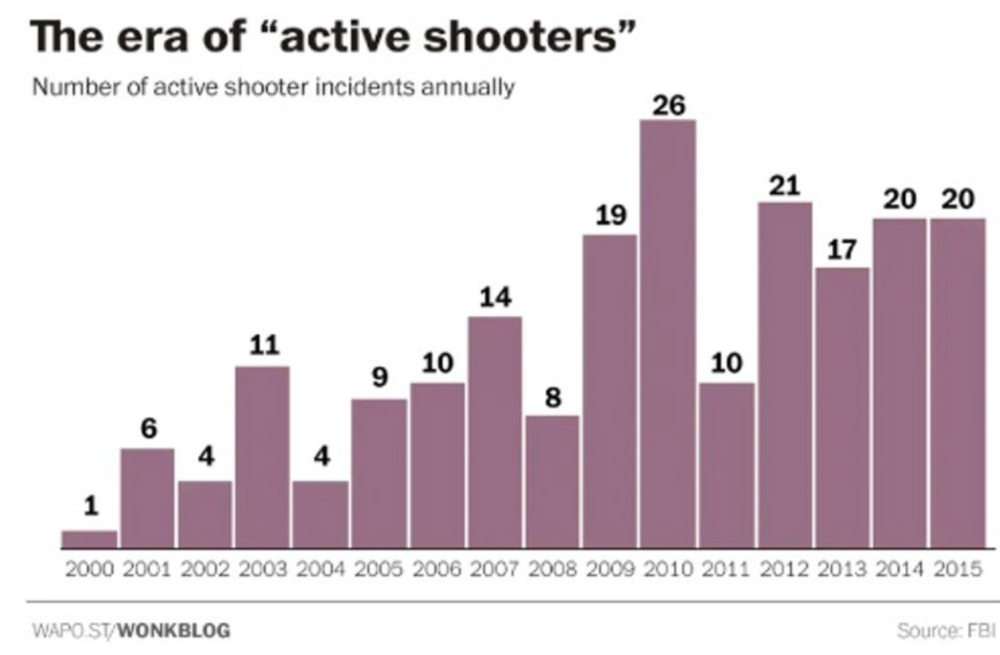

The third chapter of *Data Feminism* delves into the importance of integrating one’s emotion, intention, and experience into visualization. The graphics that the authors used in the chapter (Figures 1 and 2) question the need to ignore the qualitative aspect or objective of doing the research or presenting it. As an audience, I can tell that I am more impacted by the first visualization. As data scientists, we need to be aware of the audience because presenting to an expert in the field looks different than presenting to a newspaper reader. But, at the same time, how does one ensure that the data visualizations are not misleading? In the business world, how much regulation is needed to ensure the data that companies present in their advertisements are genuine? It also got me thinking about finding a balance between letting the audience draw their conclusions and putting one’s point of view across. 

The concept of data and visualization as being objective is a flawed one. As we discussed in the earlier classes, our personal biases and structural injustices find their way into what and how we collect data, how we process them, or what questions we choose to answer using the data. The dynamics in the society and who gets counted, the missing data also means that their stories rarely make in the mainstream reporting. Therefore, the data visualizations we see could inherently be less objective than we think. But, how objective do we need them to be? Isn’t the whole point of data visualization to inform and persuade the audience about the results? I think we need to think both about collecting and analyzing more representative data as well as being mindful about the intention and the audience for the data visualizations.
